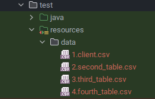

# Test Data Loader
Loads data from provided csv files into a given database, with simple controls for clearing or reloading data for all
your end-to-end test case scenarios.

# Features
1. loading data to a given DB.
2. Two operation modes: H2 and custom.
3. Native support for H2 database, which is common for test environments. (H2 mode)
4. Ability to load calculated fields, like `now()` into the db (custom mode)
5. Simple APIs to load, clear or reload data.
6. Load/clear or reload all or selected tables.
7. Ability to define order of tables to load.
8. Can be used with any database that works with `java.sql.Connection`.

# How to use
## Add dependency
```xml
    <dependency>
        <groupId>com.upshotideas</groupId>
        <artifactId>test-data-loader</artifactId>
        <version>0.0.1</version>
    </dependency>
```
## Create CSV files
Put your CSV files in `src/test/resources/data`. Ensure that:
1. file names follow this pattern: `<order>.<tableName>.csv`
2. files follow standard CSV format: (refer to the tests in this project)
   1. comma separated
   2. double quotes to wrap strings
   3. use duplicate quotes to escape quotes (Ex: for a string containing quote `"McDonald''s"` or for json: `"{ ""region"":  ""us-east-2"" }"`)
   4. first row is a header row with columns matching those in the DB.



## Contruct and use the TestDataLoader
Assuming SpringBoot, the `src/test/resources/application.yml` would look like:
```yaml
spring:
  datasource:
    url: jdbc:h2:mem:test;MODE=PostgreSQL
    platform: h2
```

And a test class, ideally a parent test class, would look like:
```java
import javax.sql.DataSource;

@SpringBootTest
public class ExampleTest {
   protected TestDataLoader dataLoader = null;
   @Autowired private DataSource dataSource;

   @PostConstruct
   public void setUpClass() {
      dataLoader = new TestDataLoader(DataSourceUtils.getConnection(dataSource));
   }

   @BeforeEach
   public void setUp() {
      dataLoader.loadTables();
   }

   @AfterEach
   public void teardown() {
      dataLoader.clearTables();
   }

   // Tests go here!
}
```
Or in case of Kotlin:
```kotlin
@SpringBootTest
class ExampleTest(private val dataSource: DataSource) {
    private var dataLoader: TestDataLoader? = null

    @PostConstruct
    fun setUpClass() {
        dataLoader = TestDataLoader(DataSourceUtils.getConnection(dataSource))
    }

    @BeforeEach
    fun setUp() {
        dataLoader!!.loadTables()
    }

    @AfterEach
    fun teardown() {
        dataLoader!!.clearTables()
    }

   // Tests go here!
}
```
